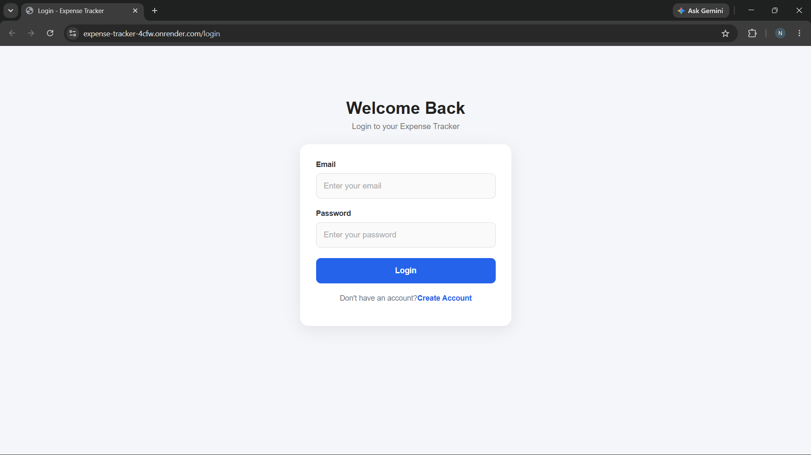
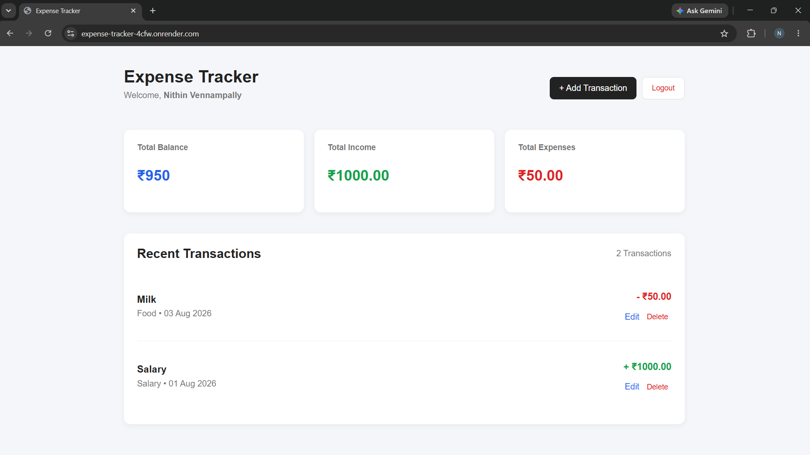
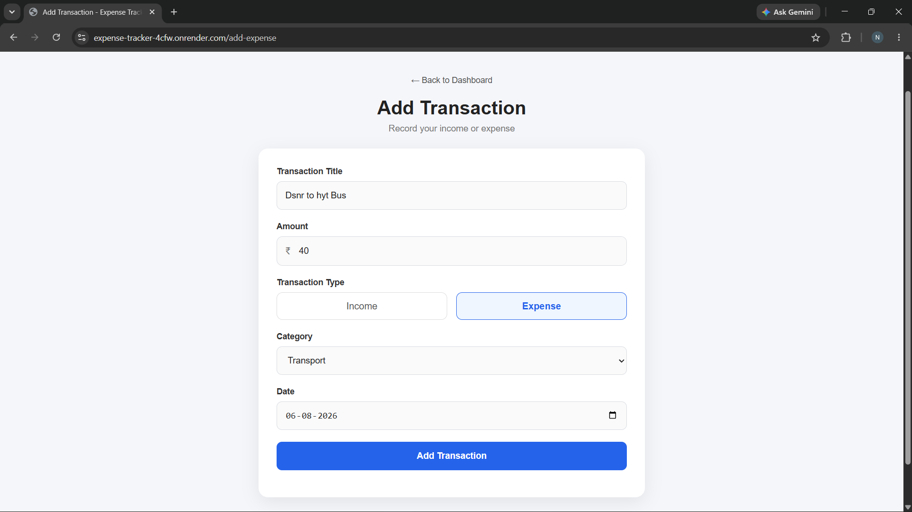

# 💰 Expense Tracker

A full-stack Expense Tracker web application built using **Node.js, Express.js, PostgreSQL, and EJS**.

The application allows users to securely create accounts, manage their income and expenses, and view their personal financial transactions.

## 🚀 Live Demo

🔗 **Live Application:** [GO_TO_WEBSITE](https://expense-tracker-4cfw.onrender.com)

## 📸 Screenshots

### 🔐 Login



### 📊 Dashboard



### ➕ Add Transaction



## ✨ Features

* 🔐 User Signup and Login
* 🔑 Password hashing using bcrypt
* 👤 User-specific transactions
* ➕ Add income and expenses
* ✏️ Edit transactions
* 🗑️ Delete transactions
* 📊 Income, expense and balance dashboard
* 🚪 Logout functionality
* 📱 Responsive user interface
* 🗄️ PostgreSQL database
* 🔒 Session-based authentication

## 🛠️ Technologies Used

### Frontend

* HTML
* CSS
* EJS

### Backend

* Node.js
* Express.js

### Database

* PostgreSQL

### Authentication

* bcrypt
* express-session

### Deployment

* Render
* PostgreSQL

## 📁 Project Structure

```text
expense-tracker/
│
├── db/
│   └── database.js
│
├── public/
│   └── css/
│       └── style.css
│
├── views/
│   ├── index.ejs
│   ├── login.ejs
│   ├── signup.ejs
│   ├── add-expense.ejs
│   └── edit-expense.ejs
│
├── screenshots/
│   ├── login.png
│   ├── dashboard.png
│   └── add-transaction.png
│
├── .gitignore
├── package.json
├── package-lock.json
├── README.md
└── server.js
```

## 🗄️ Database Structure

### Users

```text
users
-------------------------
id
name
email
password
```

### Transactions

```text
transactions
-------------------------
id
user_id
title
amount
type
category
date
```

Each transaction is connected to the user who created it using `user_id`.

Therefore, each user can only view and manage their own transactions.

## 🔐 Authentication

The application uses:

* `bcrypt` for password hashing
* `express-session` for maintaining login sessions
* User-specific database queries using `user_id`

Passwords are never stored as plain text.

## ⚙️ Installation

Clone the repository:

```bash
git clone YOUR_GITHUB_REPOSITORY_URL
```

Go into the project:

```bash
cd expense-tracker
```

Install dependencies:

```bash
npm install
```

Create a `.env` file:

```env
DATABASE_URL=YOUR_DATABASE_URL
SESSION_SECRET=YOUR_SESSION_SECRET
```

Start the application:

```bash
npm start
```

For development:

```bash
npm run dev
```

Open:

```text
http://localhost:3000
```

## 🔮 Future Improvements

* 🔎 Search transactions
* 🔽 Transaction filters
* 📅 Date-based filtering
* 📊 Expense charts
* 📈 Monthly reports
* 💳 More transaction categories
* 🌙 Dark mode
* 📱 Improved mobile UI


Built as a full-stack development project to practice Node.js, Express.js, PostgreSQL, authentication, CRUD operations, and deployment.
